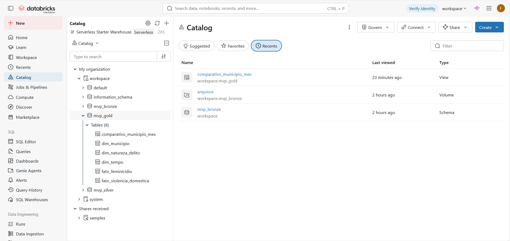
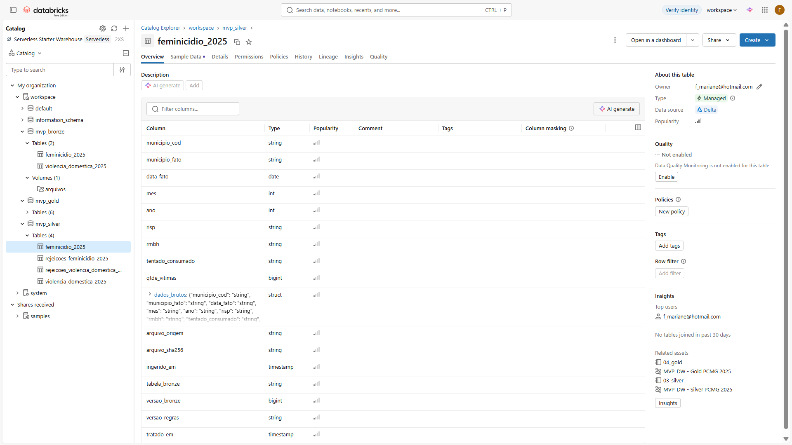
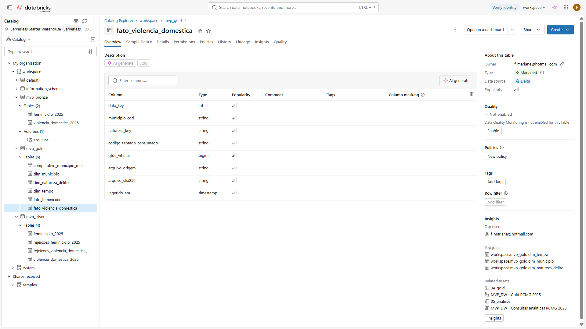
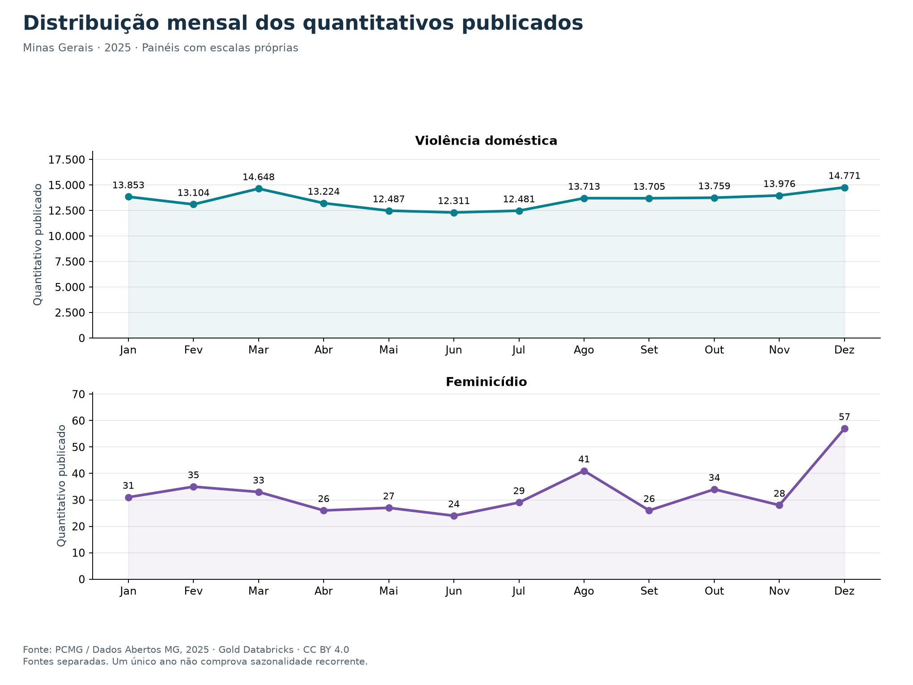
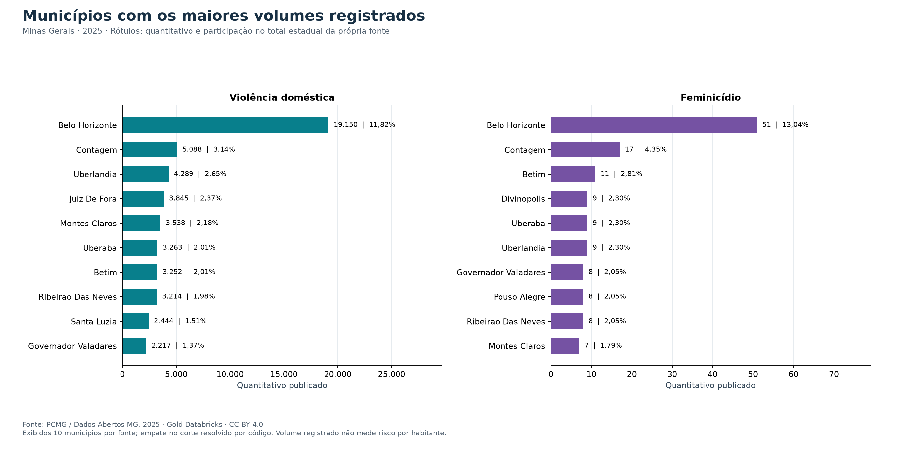
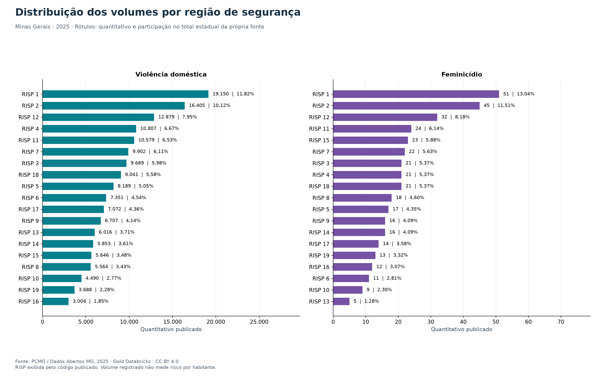
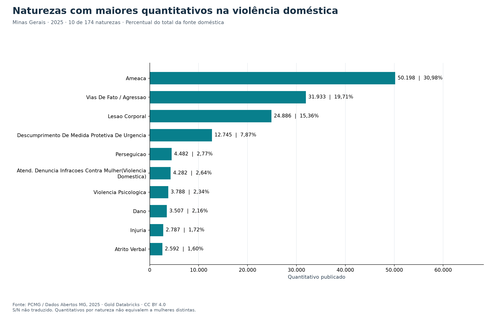
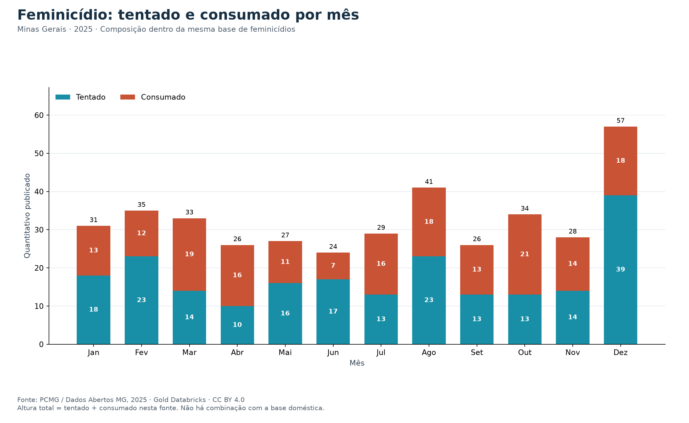
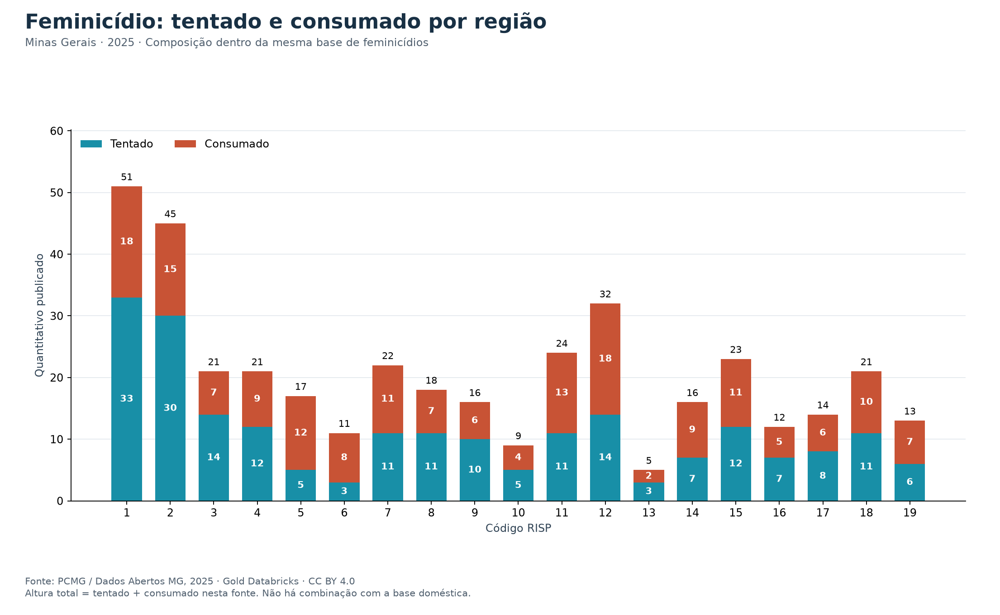
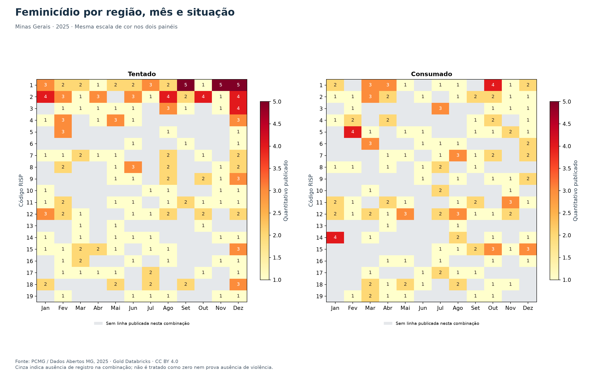

# Violência doméstica e feminicídios em Minas Gerais em 2025

Foi construído um pipeline no Databricks Free Edition para análise de duas bases da Polícia Civil de Minas Gerais. Foram realizadas ingestão, verificação de qualidade, transformação e modelagem dimensional. Foram respondidas quatro perguntas por meio de sete consultas SQL e sete gráficos. Neste README, foram reunidos o relatório, a correspondência com os critérios de avaliação e os links para verificação dos arquivos. Atualização: 25/09/2026.

## Índice de navegação

Ordem apresentada foi sugerida na especificação da construção do MVP. Índice adicionado para praticidade na avaliação
1. [Contexto de Negócios e Perguntas](#contexto)
2. [Carga dos Dados](#carga)
3. [Modelagem e Catálogo de Dados](#modelagem)
4. [Pipeline de Dados](#pipeline)
5. [Qualidade de Dados](#qualidade)
6. [Análise de Dados](#analise)
7. [Autoavaliação](#autoavaliacao)
8. [Evidências e reprodução](#evidencias)
<a id="contexto"></a>

## 1. Contexto de Negócios e Perguntas

Foi considerado o problema de organizar registros de violência contra a mulher para apoiar estudos temporais e territoriais. Como público de referência, foram considerados analistas interessados no planejamento de investigações e na identificação de concentrações de registros. Foi definido como objetivo construir uma base rastreável, com métricas consistentes e documentação das diferenças entre as fontes.

Foram selecionados registros de Minas Gerais com datas de 01/01/2025 a 31/12/2025. Foram utilizados [violencia_domestica_2025.csv](violencia_domestica_2025.csv) e [feminicidio_2025.csv](feminicidio_2025.csv), publicados pela PCMG no [Portal de Dados Abertos de Minas Gerais](https://dados.mg.gov.br/pt_PT/dataset/violencia%2Dcontra%2Dmulher). Foi registrada a data de download de 22/09/2026, informada pelo autor. Foi identificada a licença CC BY 4.0 no dicionário da publicação, sendo mantida a atribuição à PCMG. A licença dos dados foi distinguida da licença do código.

Foram lidos CSVs com separador ponto e vírgula e codificação UTF8. Na base doméstica, foram identificadas 117.169 linhas e dez colunas; na base de feminicídios, 381 linhas e nove colunas. Foram observados registros em 853 municípios na primeira e em 183 na segunda.

Em ambas, foram disponibilizados `municipio_cod`, `municipio_fato`, `data_fato`, `mes`, `ano`, `risp`, `rmbh`, `tentado_consumado` e `qtde_vitimas`. Apenas na fonte doméstica foi disponibilizado `natureza_delito`. Nesses campos, foram representados município, data, região de segurança, recorte metropolitano, classificação e quantidade publicada de vítimas. Não foi disponibilizado identificador de pessoa ou ocorrência. Uma linha não foi interpretada como uma mulher distinta ou um crime individual.

Foram formuladas as seguintes perguntas:

1. Como os quantitativos de vítimas registrados se distribuem pelos meses de 2025 em cada base?
2. Quais municípios e regiões de segurança concentram os maiores quantitativos em cada base?
3. Quais naturezas de delito concentram os maiores quantitativos na base de violência doméstica?
4. Como os quantitativos de vítimas de feminicídio tentado e consumado se distribuem por região e mês?

As quatro perguntas foram mantidas e respondidas. Nenhuma foi descartada. Foram preservados o [planejamento original](docs/contexto_objetivos.md) e a [validação das fontes, licença e hashes](docs/validacao_bases_2025.md).

<a id="carga"></a>

## 2. Carga dos Dados

Foi utilizado o Databricks Free Edition com processamento serverless e tabelas Delta. O acesso por terminal foi realizado pelo Databricks CLI no WSL, com perfil `MVP_DW`. Os arquivos foram enviados ao volume `/Volumes/workspace/mvp_bronze/arquivos`.

Foram calculados hashes SHA256 e preservadas cópias identificadas por conteúdo. Na Bronze, os campos de negócio foram mantidos como texto, com acréscimo de `arquivo_origem`, `arquivo_sha256` e `ingerido_em`. Foi preservada a rastreabilidade até os arquivos, sem alteração dos valores originais.

Foram persistidas `workspace.mvp_bronze.violencia_domestica_2025` e `workspace.mvp_bronze.feminicidio_2025`. Foram reconciliadas 117.169 linhas e soma de 162.032 na primeira, além de 381 linhas e soma de 391 na segunda. Os totais das duas fontes não foram somados.

Foram disponibilizados o [notebook Bronze](notebooks/01_bronze.py), a [configuração do job](databricks/bronze_job.json) e a [evidência da carga](evidencias/bronze_207087315322185.json).


<a id="modelagem"></a>

## 3. Modelagem e Catálogo de Dados

Foram criados os schemas `mvp_bronze`, `mvp_silver` e `mvp_gold` no catálogo `workspace`. Na extração de metadados, foram identificados 12 objetos tabulares, 136 colunas e um volume, incluindo tabelas de rejeição e view.

Na Silver, foram mantidas duas tabelas de negócio e duas tabelas de rejeição. Foram convertidos os tipos de data, mês, ano e quantidade. Os valores originais foram preservados em `dados_brutos`, com versão da Bronze, versão das regras e instante do tratamento.

Na Gold, foram utilizadas duas fatos e três dimensões. A separação das fatos foi adotada porque não foi disponibilizada chave para reconhecer eventos ou pessoas comuns às fontes.

1. **dim_tempo:** foram geradas 365 linhas, uma por dia de 2025, com chave inteira `data_key` no formato AAAAMMDD, data, ano, mês, dia e trimestre.
2. **dim_municipio:** foram reunidos 853 códigos textuais de seis dígitos, com nome, UF, RISP e recorte metropolitano. Foi adotado `municipio_cod` como chave lógica.
3. **dim_natureza_delito:** foram identificadas 174 naturezas, com chave textual SHA256 do nome normalizado e conservação da categoria publicada.
4. **fato_violencia_domestica:** foram mantidas 117.169 linhas, na granularidade observada de município, dia, natureza e código S/N. Foram relacionadas as três dimensões, com medida `qtde_vitimas` BIGINT e metadados de origem.
5. **fato_feminicidio:** foram mantidas 381 linhas, na granularidade de município, dia e situação. Foram relacionadas município e tempo, com situação TENTADO ou CONSUMADO, medida BIGINT e metadados de origem.
6. **comparativo_municipio_mes:** foram produzidas 9.296 combinações. Cada fato foi agregada separadamente antes da junção externa completa. Foram mantidas medidas distintas, valores nulos para ausências e indicadores de presença.

As chaves foram verificadas logicamente no pipeline, sem declaração de restrições PK/FK no catálogo. Foram confirmadas unicidade, ausência de referências órfãs e preservação dos totais nas junções.

Foram documentados contexto, campos, tipos, domínios e origem no [catálogo completo](docs/catalogo_dados.md), no [dicionário Gold](docs/catalogo_gold.md), no [esquema físico](docs/esquema_fisico.md) e nos [domínios observados](docs/dominios_observados.md). Foram disponibilizados o [modelo dimensional](docs/modelagem_dimensional.md) e a [linhagem](docs/linhagem_dados.md). A linhagem foi documentada a partir do código e das evidências, sem ser apresentada como captura automática do Unity Catalog.







<a id="pipeline"></a>

## 4. Pipeline de Dados

Foi adotada a separação por responsabilidade, na sequência Bronze → qualidade → Silver → Gold → análises. O processamento e as consultas foram executados na nuvem. Os gráficos foram renderizados localmente a partir dos resultados remotos, sem recálculo sobre os CSVs originais.

1. No [notebook 01](notebooks/01_bronze.py), foram preservados os arquivos e persistidas as tabelas Bronze.
2. No [notebook 02](notebooks/02_qualidade.py), foram executados testes sintéticos e controles sobre os dados originais.
3. No [notebook 03](notebooks/03_silver.py), foram aplicados tratamentos, separadas rejeições e reconciliadas quantidades.
4. No [notebook 04](notebooks/04_gold.py), foram construídas dimensões, fatos e view, com validação das relações.
5. No [notebook 05](notebooks/05_analises.py), foram executadas sete consultas sobre versões Delta fixadas em zero, com conferência de somas e percentuais.

Foram disponibilizadas as [configurações dos jobs](databricks/), as [consultas SQL](sql/consultas_analiticas.sql), o [coletor de evidências](scripts/capturar_evidencia_bronze.py), o [extrator de catálogo](scripts/catalogar_databricks.py) e o [gerador de gráficos](scripts/gerar_graficos.py).

Nas reexecuções individuais de Bronze, Silver e Gold, foram validados os objetos existentes sem acréscimo de linhas. Em caso de divergência, a publicação é interrompida sem sobrescrita automática. Não foi implementada uma transação única entre todas as tabelas. Não foi concluída uma nova reexecução integrada após a consolidação documental.


Na imagem, são exibidas execuções bem sucedidas e uma tentativa anterior da Bronze com falha. Para comprovação dos resultados utilizados, foram vinculados os JSON das execuções aprovadas; o histórico não foi interpretado como ausência de falhas.

<a id="qualidade"></a>

## 5. Qualidade de Dados

Foram verificados completude, formatos, coerência temporal, domínios, quantidades, duplicidades e rastreabilidade. Nas duas fontes, foram encontrados zero campos ausentes, zero datas inválidas, zero inconsistências entre data e mês ou ano e zero quantidades inválidas. Foram observadas quantidades por linha de 1 a 31 na fonte doméstica e de 1 a 2 na fonte de feminicídios.

Não foram encontradas linhas integralmente duplicadas nem repetições das chaves operacionais antes ou depois da normalização. Quantidades elevadas não foram excluídas automaticamente como anomalias. As faixas observadas foram registradas como diagnóstico, sem imposição de limites permanentes. A acurácia dos acontecimentos reais não pôde ser comprovada apenas pela consistência interna dos arquivos.

Foi identificada divergência de nome para o código `315990`. A forma `SANTO ANT DO AMPARO` foi padronizada para `SANTO ANTONIO DO AMPARO`, já presente na outra fonte. Foram alteradas 109 linhas domésticas, com preservação do texto original e sem mudança nas quantidades. Não foram detectados espaços externos nos arquivos atuais; sua remoção foi mantida como regra preventiva.

Na fonte doméstica, foram preservados os códigos S/N. Não foi encontrada confirmação oficial suficiente de sua correspondência com tentado ou consumado. Na fonte de feminicídios, foram utilizados exclusivamente os rótulos explícitos TENTADO e CONSUMADO.

Na Silver, foram obtidas zero rejeições e preservados os totais de cada fonte. Na Gold, foram novamente preservadas 117.169 linhas e soma de 162.032 na doméstica, além de 381 linhas e soma de 391 no feminicídio. Não foi identificada multiplicação das medidas nas junções. Foram aprovados testes sintéticos para datas impossíveis, códigos ausentes, quantidades fracionadas, estouro de BIGINT e colisões de chaves, entre outras situações.

Foram disponibilizados o [diagnóstico](docs/qualidade_bronze.md), as [regras Silver](docs/regras_silver.md), a [reconciliação](docs/reconciliacao_silver.md) e a [validação Gold](docs/validacao_gold.md). As saídas foram preservadas no [HTML de qualidade](evidencias/05_qualidade.html), no [JSON de qualidade](evidencias/qualidade_183810729128831.json), no [HTML Gold](evidencias/06_gold.html) e no [JSON da reexecução Gold](evidencias/gold_483524129599626.json).

<a id="analise"></a>

## 6. Análise de Dados

Foi utilizada `SUM(qtde_vitimas)` como medida. Para cada percentual, foi adotado o total da própria fonte ou do recorte indicado. Os resultados foram preservados no [JSON analítico](evidencias/analises_931355409551552.json) e no [HTML das consultas](evidencias/07_consultas%20analiticas.html).

### Pergunta 1. Como os quantitativos se distribuem pelos meses?

Na fonte doméstica, foi obtido o total de 162.032. O maior volume foi observado em dezembro, com 14.771 e 9,12% do ano; o menor foi observado em junho, com 12.311. Foi calculada diferença de 19,98% entre esses extremos, tomando o menor como denominador.

Na fonte de feminicídios, foi obtido o total de 391. O maior volume também foi observado em dezembro, com 57 e 14,58%; o menor, em junho, com 24. Foi calculada diferença de 137,50% entre esses extremos.

Foi identificada maior variação relativa na série de feminicídios, composta por quantitativos menores. Não foi demonstrada sazonalidade recorrente com apenas um ano. Também não foram isolados efeitos da duração dos meses, da cobertura ou do registro.



Foram disponibilizados os 24 agregados em [resultados mensais](resultados/q1_mensal.json).

### Pergunta 2. Quais municípios e regiões concentram os maiores quantitativos?

Na fonte doméstica, foi observado o maior volume em Belo Horizonte, com 19.150 e 11,82% do total. Nos dez municípios exibidos, foram concentrados 31,04% dos quantitativos. Regionalmente, foi identificada a RISP 1 na primeira posição, também com 19.150 e 11,82%.

Na fonte de feminicídios, foi identificado o maior volume municipal em Belo Horizonte, com 51 e 13,04%. Nos dez municípios exibidos, foram concentrados 35,04% do total. Regionalmente, foi identificada a RISP 1 como principal concentração, com 51 e 13,04%.

Foi respondida a pergunta sobre volume absoluto. Não foi atribuída maior taxa de risco a esses territórios, pois não foi incorporado denominador populacional. No ranking completo, foram conservados empates com `DENSE_RANK`; no limite de dez municípios do gráfico, foi utilizado o código municipal para ordenar empates.





Foram disponibilizados os resultados completos de [municípios](resultados/q2_municipios.json) e [regiões](resultados/q2_regioes.json).

### Pergunta 3. Quais naturezas concentram os maiores quantitativos domésticos?

Foram identificadas AMEACA, com 50.198 e 30,98%; VIAS DE FATO / AGRESSAO, com 31.933 e 19,71%; e LESAO CORPORAL, com 24.886 e 15,36%. Foram preservados os rótulos da publicação.

Nessas três naturezas, foram concentrados 107.017 quantitativos, equivalentes a 66,05% da fonte doméstica. Foi identificada concentração em três das 174 categorias observadas. Não foi inferida equivalência de gravidade entre categorias nem contagem de mulheres distintas.



Foi disponibilizado o [resultado das 174 naturezas](resultados/q3_naturezas.json).

### Pergunta 4. Como se distribuem feminicídios tentados e consumados por região e mês?

Foram contabilizados 213 quantitativos classificados como tentados, equivalentes a 54,48%, e 178 como consumados, equivalentes a 45,52%. Entre os tentados, foi observado o maior volume mensal em dezembro, com 39. Entre os consumados, foi observado o maior volume em outubro, com 21.

Regionalmente, foi identificado o maior volume de tentados na RISP 1, com 33, seguida da RISP 2, com 30. Nos consumados, foi observado empate entre as RISP 1 e 12, com 18 em cada uma. Na RISP 6, foram observados oito consumados e três tentados, sendo calculada participação de 72,73% de consumados. Na RISP 5, foram observados 12 consumados e cinco tentados, com participação de 70,59%. Esses percentuais foram interpretados junto dos pequenos quantitativos absolutos.







No mapa de calor, foi utilizada a mesma escala para as duas situações. As combinações sem linha publicada foram representadas em cinza, sem imputação de zero. Não foi interpretada a participação de consumados como probabilidade de uma tentativa resultar em morte.

Foram preservados os resultados por [mês e situação](resultados/q4_mes_situacao.json), [região e situação](resultados/q4_regiao_situacao.json) e [região, mês e situação](resultados/q4_regiao_mes_situacao.json).

### Discussão integrada e perguntas não realizadas

Foi demonstrada a possibilidade de consultar os registros por tempo, território e classificação, com preservação dos totais de origem. Foram identificados dezembro como mês de maior volume nas duas fontes, Belo Horizonte como principal concentração municipal e três naturezas como responsáveis por aproximadamente dois terços do quantitativo doméstico. Foram observadas diferenças entre as distribuições de tentados e consumados.

Nenhuma das quatro perguntas originais foi descartada. Foram excluídas do escopo interpretações sem suporte nos dados: taxas por habitante, por ausência de população de referência; trajetórias individuais e conversão de violência doméstica em feminicídio, por ausência de identificadores e desconhecimento da sobreposição; causalidade e previsão, por ausência de desenho apropriado; sazonalidade recorrente, pela restrição a um ano. A tradução de S/N não foi presumida e não foi necessária para as perguntas formuladas.

Os resultados foram interpretados como quantitativos publicados, sujeitos a cobertura, subnotificação e revisões. Não foi calculado um total combinado das fontes. Foi delimitado o uso das análises como descrição dos registros e apoio à formulação de novos estudos.

<a id="autoavaliacao"></a>

## 7. Autoavaliação

Foi alcançado o objetivo técnico de construir e executar um pipeline na nuvem, com dados originais preservados, tratamentos documentados, modelo dimensional e respostas às quatro perguntas. Foram produzidas evidências de carga, qualidade, reconciliação, persistência e análise. A reprodutibilidade foi favorecida pela separação dos notebooks e pelo registro de versões e resultados.

Como dificuldades, foram identificadas a ambiguidade de S/N, a divergência de nome municipal e a impossibilidade de relacionar pessoas entre as fontes. A primeira foi mantida como limitação; a segunda foi resolvida por correspondência documentada; a terceira foi tratada pela separação das fatos e medidas. Na captura de evidências, foi encontrado bloqueio ao controle automatizado do console. Foram então fornecidas capturas manuais e exportações HTML pelo autor.

Não foi concluída a confirmação oficial de S/N nem a validação dos códigos municipais contra cadastro externo. Até esta revisão, não foi realizada nova execução integrada após a consolidação da entrega. As reexecuções individuais aprovadas não foram apresentadas como substitutas dessa verificação final. As exportações HTML foram incluídas como evidências complementares, sem serem classificadas como screenshots dos resultados.

Como trabalhos futuros, são propostas a confirmação semântica junto ao publicador, a inclusão de séries históricas e denominadores populacionais compatíveis, a execução integrada automatizada e a revisão do modelo para novas versões. A incorporação de outras fontes deverá ser precedida de avaliação de definições, cobertura e chaves.

<a id="evidencias"></a>

## Evidências e reprodução

### Exportações HTML para visualização

Foram preservados os arquivos fornecidos pelo autor com código e saídas exportadas do Databricks:

1. [Execução de qualidade em HTML](evidencias/05_qualidade.html).
2. [Execução Gold em HTML](evidencias/06_gold.html).
3. [Consultas analíticas em HTML](evidencias/07_consultas%20analiticas.html).

Quando o arquivo for apresentado como código pelo visualizador do repositório, sua visualização completa poderá ser obtida por download e abertura no navegador. Não foi configurada hospedagem pública dos HTML. As exportações foram distinguidas das capturas do console, e os gráficos foram identificados como renderizações locais dos resultados remotos.

### Índice de evidências e implementação

1. Bronze: [carga](evidencias/bronze_207087315322185.json) e [reexecução](evidencias/bronze_1001589874049096.json).
2. Qualidade: [diagnóstico remoto](evidencias/qualidade_183810729128831.json).
3. Silver: [carga reconciliada](evidencias/silver_169682925174743.json) e [reexecução](evidencias/silver_572585419270618.json).
4. Gold: [carga validada](evidencias/gold_700142655207447.json) e [reexecução](evidencias/gold_483524129599626.json).
5. Análises: [execução](evidencias/analises_931355409551552.json), [SQL](sql/consultas_analiticas.sql) e [resultados completos](resultados/).
6. Catálogo: [metadados extraídos](evidencias/catalogo_databricks.json) e [documentação técnica](docs/).
7. Implementação: [notebooks](notebooks/), [scripts](scripts/) e [configurações dos jobs](databricks/).
8. Imagens: [capturas manuais](evidencias/screenshots/) e [gráficos PNG e SVG](graficos/).

### Reprodução

Foi documentada a execução pelo WSL com zsh no [guia do Databricks](docs/execucao_databricks.md). Para reprodução, deverão ser disponibilizados os CSVs no volume indicado e ajustados os caminhos do workspace nas configurações dos jobs. Deverão ser executados os cinco notebooks na ordem descrita e conferidos os totais. Deverão ser utilizadas credenciais próprias, sem inclusão de segredos no repositório.

Para os gráficos, foi utilizado Python 3.12 com Matplotlib 3.11.2 e NumPy 2.5.3. As versões foram registradas no [arquivo de dependências](requirements%2Dgraficos.txt). Após a preparação dessas dependências, a renderização poderá ser repetida a partir da raiz do projeto:

```zsh
python3.12 scripts/gerar_graficos.py evidencias/analises_931355409551552.json
```

A ausência de duplicação deverá ser conferida após nova execução. A publicação final, o acesso público sem autenticação e a submissão do link no fórum deverão ser verificados separadamente; não são comprovados pela presença deste relatório.
