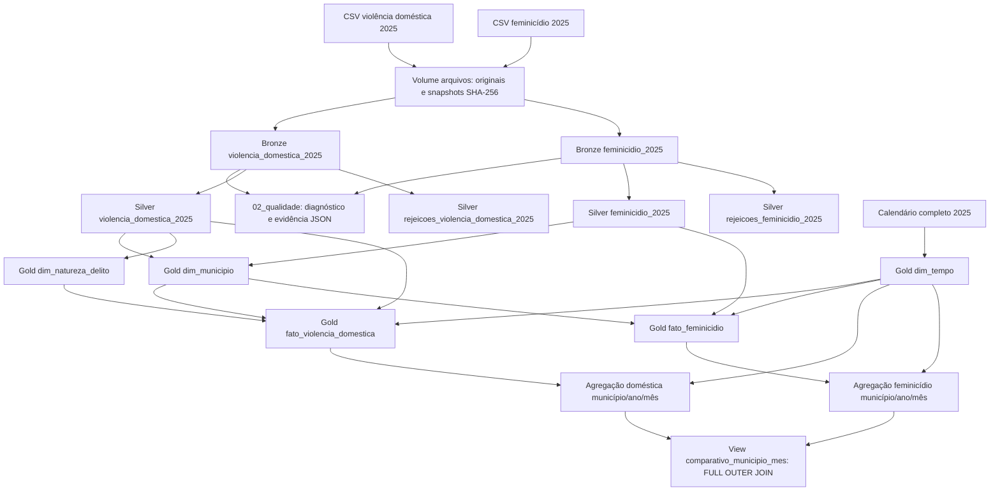

# Linhagem — fontes → Bronze → Silver → Gold

Linhagem documentada a partir dos notebooks versionáveis, metadados extraídos
do Unity Catalog e resultados reais dos jobs. Não é uma exportação da visualização
automática de linhagem do Databricks. [Catálogo completo](catalogo_dados.md).

## Fluxo de objetos

Bronze, Silver e Gold usam respectivamente `workspace.mvp_bronze`,
`workspace.mvp_silver` e `workspace.mvp_gold`. Rejeições ficam fora do caminho
de publicação; qualquer rejeição bloqueia a Silver de negócio deste snapshot.

## Fontes e identidade dos arquivos

Publicador: PCMG, conjunto de violência contra a mulher em Minas Gerais,
recorte 2025. URLs, licença e data de obtenção estão na [proveniência](validacao_bases_2025.md).

| Arquivo | SHA-256 |
| --- | --- |
| violencia_domestica_2025.csv | 0d6e677ab65e7d04834904080ec0296eccf8dabd6013fe45910c9d754f94b4fe |
| feminicidio_2025.csv | 364dec0197c1d9c40a050883573ce22efd280a43114680fc1491e40db6e89630 |

Cópias preservadas em `/Volumes/workspace/mvp_bronze/arquivos/snapshots/<sha256>/<arquivo>`.
O hash representa bytes do arquivo, não identidade de uma ocorrência. O original
no volume é conferido contra a referência antes da leitura. Uma revisão não é
tratada como conjunto de novos eventos a acrescentar indiscriminadamente.

## Transformações por coluna

| Origem | Destino | Transformação / validação |
| --- | --- | --- |
| Campos CSV | Bronze campos homônimos | Leitura `;`, UTF-8, campos STRING, preservação dos textos |
| Bytes e caminho do arquivo; relógio UTC | Bronze arquivo_sha256, arquivo_origem, ingerido_em | SHA-256; caminho do snapshot; timestamp de ingestão |
| Bronze campos originais | Silver dados_brutos.* | Cópia fiel em STRUCT; igualdade por exceptAll nos dois sentidos |
| Bronze municipio_cod, risp, rmbh | Silver homônimos | Trim e validação de formato/domínio; códigos como texto |
| Bronze municipio_fato | Silver municipio_fato | Trim; correspondência explícita no código 315990 |
| Bronze data_fato, mes, ano, qtde_vitimas | Silver homônimos | Conversão DATE/INT/INT/BIGINT; rejeição de erro, sem arredondar ou imputar |
| Bronze natureza_delito, tentado_consumado | Silver homônimos | Upper/trim; acentos e espaços internos mantidos; S/N não traduzido |
| Metadados Bronze | Metadados Silver e fatos Gold | Propagação do caminho, hash e instante original |
| Tabela/versão Delta de entrada, contrato, relógio UTC | Silver tabela_bronze, versao_bronze, versao_regras, tratado_em | Rastreabilidade técnica da transformação |
| Resultado de validações Silver | Tabelas de rejeições | Dados brutos e tratados, motivos, flag da quantidade e UUID da execução |
| Calendário gerado 2025 | dim_tempo | Uma linha/dia; chave INT AAAAMMDD; ano, mês, dia, trimestre derivados |
| Silver de ambas as fontes: município/nome/RISP/RMBH | dim_municipio | União de tuplas distintas; exigir unicidade por código; UF constante MG |
| Silver doméstica natureza_delito | dim_natureza_delito | Nomes distintos normalizados; SHA-256 UTF-8 determinístico |
| Silver data_fato | Fatos data_key | Lookup em dim_tempo, sem perder ou multiplicar linhas |
| Silver municipio_cod | Fatos municipio_cod | Chave mantida e existência verificada em dim_municipio |
| Silver doméstica natureza_delito | Fato doméstica natureza_key | Lookup em dim_natureza_delito |
| Silver doméstica tentado_consumado | Fato doméstica codigo_tentado_consumado | Renomeação; S/N preservado |
| Silver feminicídio tentado_consumado | Fato feminicídio situacao | Renomeação; TENTADO/CONSUMADO preservados |
| Silver qtde_vitimas | Fatos qtde_vitimas | Sem nova agregação; conservação por linha e de totais |
| Cada fato + dim_tempo | View comparativo_municipio_mes | SUM separado por município/ano/mês; depois FULL OUTER JOIN, flags de presença e NULL nas ausências |

## Execuções e versões comprovadas

| Etapa | Notebook | Job | Execução aprovada | Evidência |
| --- | --- | --- | --- | --- |
| Bronze | 01_bronze.py | 699928499146328 | 207087315322185 | [Carga](../evidencias/bronze_207087315322185.json) |
| Qualidade | 02_qualidade.py | 1005669937621880 | 183810729128831 | [Diagnóstico](../evidencias/qualidade_183810729128831.json) |
| Silver | 03_silver.py | 1075813885223029 | 169682925174743 | [Reconciliação](../evidencias/silver_169682925174743.json) |
| Gold | 04_gold.py | 465875515640680 | 700142655207447 | [Validação](../evidencias/gold_700142655207447.json) |
| Análises | 05_analises.py | 252723981011762 | 931355409551552 | [Consultas](../evidencias/analises_931355409551552.json) |

Qualidade e Silver leram versão Delta 0 de cada Bronze; a Gold leu versão Delta 0
de cada Silver. `versao_bronze` fica por linha na Silver. Versões Silver usadas
pela Gold ficam no relatório `fontes_silver`, não como coluna das fatos.
Os IDs Delta dos relatórios e os IDs dos objetos Unity Catalog do inventário
identificam recursos diferentes e não devem ser confundidos.

Reexecuções aprovadas, sem duplicação: [Bronze](../evidencias/bronze_1001589874049096.json),
[Silver](../evidencias/silver_572585419270618.json), [Gold](../evidencias/gold_483524129599626.json).
Essas execuções individuais não equivalem ao teste integrado final do item 23.

As análises leem as cinco tabelas Gold na versão 0 e agregam as medidas conforme
as quatro perguntas. O resultado remoto alimenta `scripts/gerar_graficos.py`,
que exporta figuras PNG/SVG e o relatório local. Não há releitura dos CSVs para
calcular os gráficos. SQL e versões de entrada são preservados na evidência.

## Barreiras de qualidade e limites

Antes da Silver: validar campos obrigatórios, datas e coerência temporal,
domínios, quantidades e duplicidades; registrar rejeições e reconciliar
entrada = candidatos + rejeições. Antes e depois das junções Gold: validar
unicidade dimensional, referências e conservação de linhas/somas.

Tabelas candidatas são comparadas com tabelas existentes; divergências falham
sem sobrescrita. Publicação é individual por objeto, sem transação conjunta.
Consumir somente após execução aprovada. A view é dinâmica sobre as tabelas
Gold atuais; não é uma fotografia materializada independente.

Os dados publicados não têm identificadores de pessoas. Não existe vínculo
individual entre as fontes nem evidência de trajetória doméstica → feminicídio.
Totais não são somados entre fontes e ausências não são inferidas como zero.
