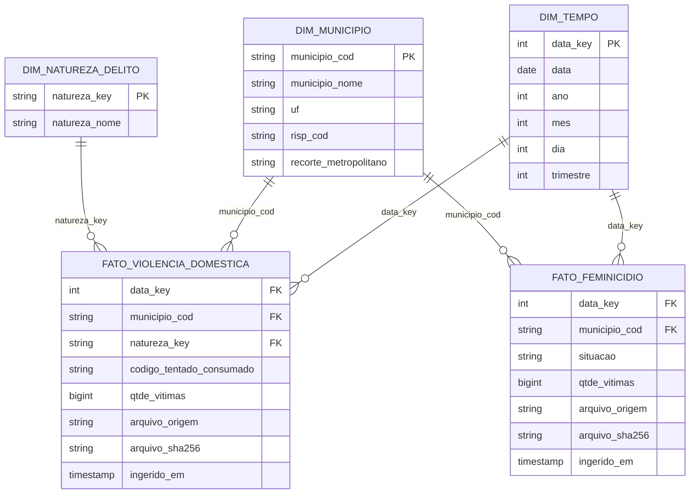

# Modelagem dimensional — MG, 2025

## Decisão e estado

Modelo lógico e catálogo inicial para o MVP de violência doméstica contra a mulher e feminicídios. São duas estrelas com dimensões compartilhadas de tempo e município. A medida principal é o quantitativo de vítimas publicado, mantido por fonte. Não há ligação entre pessoas ou ocorrências das duas bases.

O desenho foi confrontado com os CSVs locais e implementado no Databricks. Bronze, Silver e Gold foram validadas; a [evidência Gold](validacao_gold.md) confirma dimensões, fatos, chaves e preservação dos totais nas junções.

## Diagrama

## Granularidade e chaves

| Tabela Gold | Uma linha representa | Chave lógica |
| --- | --- | --- |
| dim_tempo | Um dia do calendário de 2025 | data_key = AAAAMMDD |
| dim_municipio | Um código municipal da publicação, no recorte de 2025 | municipio_cod |
| dim_natureza_delito | Uma natureza de delito normalizada | natureza_key |
| fato_violencia_domestica | Quantitativo publicado para município, dia, natureza e código S/N | data_key + municipio_cod + natureza_key + codigo_tentado_consumado |
| fato_feminicidio | Quantitativo publicado para município, dia e situação | data_key + municipio_cod + situacao |

As chaves compostas são únicas nas cópias verificadas, mas não são IDs de ocorrência. A granularidade operacional preserva os grupos observados; não estabelece unicidade de pessoas. Repetições inesperadas numa nova carga devem interromper a publicação da Gold para investigação, não ser apagadas ou somadas automaticamente.

Não é necessário criar um identificador artificial da fato. O código municipal de seis caracteres será preservado como texto, sem acrescentar dígito ou pressupor equivalência com outros códigos. A chave de natureza será SHA-256 hexadecimal do nome após remoção de espaços externos e conversão para maiúsculas em UTF-8, mantendo acentos e espaços internos. Isso permite regenerar a dimensão com chaves estáveis; validar unicidade da chave e correspondência com o nome.

## Dimensões e classificações

- **Tempo:** calendário completo com 365 dias. Mês, ano, dia e trimestre são derivados da data validada. Meses sem linhas não serão automaticamente interpretados como zero em toda análise.
- **Município:** união dos códigos das duas fontes, com 853 membros. Nome, RISP e recorte metropolitano ficam na mesma dimensão, simplificando consultas. Os códigos de RISP são 1 a 19; o arquivo não fornece seus nomes.
- **Natureza:** 174 categorias observadas, exclusiva da fato de violência doméstica. Não atribuir natureza genérica às linhas de feminicídio para forçar uma unificação.
- **Situação:** atributos categóricos nas próprias fatos, sem dimensão adicional para dois valores. Em feminicídio, preservar TENTADO/CONSUMADO. Em violência doméstica, preservar S/N com semântica pendente; não harmonizar os dois domínios.

A dimensão municipal será uma fotografia do recorte, sem histórico SCD tipo 2 neste MVP. Mudanças futuras de RISP ou nomes deverão ser avaliadas antes de incluir outros anos. Conflitos de atributos por código bloqueiam a geração da dimensão até uma regra documentada ser definida.

## Regra municipal comprovada na inspeção

O código `315990` aparece como `SANTO ANTONIO DO AMPARO` na base de feminicídios e `SANTO ANT DO AMPARO` na base de violência doméstica. Para apresentação, usar `SANTO ANTONIO DO AMPARO`, nome completo presente na própria fonte. Trata-se de uma padronização interna, sem alegar validação externa de nome oficial. O diagnóstico remoto e a releitura local de 24/09 não identificaram espaço externo; a anotação anterior sobre esse espaço foi corrigida.

Remover espaços externos e aplicar essa correspondência explícita. Bronze e campos brutos da Silver preservam os valores originais. Não escolher nomes arbitrariamente com first/max. Não foram encontrados conflitos de RISP ou recorte metropolitano por código nas duas cópias locais.

## Fluxo e linhagem propostos

1. **Bronze:** preservar os dois CSVs e criar duas tabelas com campos originais como texto, arquivo de origem, SHA-256 e instante de ingestão UTC. Cada ingestão identifica um snapshot, não novos eventos para acumular indefinidamente.
2. **Silver:** duas tabelas separadas. Converter datas com formato AAAA-MM-DD, validar ano/mês, converter quantidades para inteiro, tratar espaços externos e manter classificações originais. Preservar nome municipal bruto junto do padronizado e rastreabilidade até arquivo/snapshot. Linhas inválidas devem ser registradas com motivo; a aprovação da carga exige reconciliação de entradas, rejeições e saídas.
3. **Gold:** construir dimensões por união das Silver, resolver chaves por junções muitos-para-um e carregar as duas fatos sem alterar sua granularidade. Reconciliar linhas e soma de vítimas antes/depois de cada junção.

Ordem: Bronze → Silver validada → dimensões → fatos → consultas. Para este recorte fechado, a implementação valida candidatos completos de 2025 e cria tabelas ausentes. Tabelas existentes devem corresponder aos candidatos; divergências bloqueiam a execução sem sobrescrita. Não há append de snapshots nas fatos. Histórico de arquivos fica na Bronze. A repetição mantém os mesmos totais de negócio. Cada tabela é publicada individualmente, sem transação conjunta entre objetos; revisões da fonte exigem procedimento específico antes de substituir a versão publicada.

## Consultas e medidas

| Pergunta | Caminho no modelo |
| --- | --- |
| Distribuição mensal por fonte | Cada fato → dim_tempo; SUM(qtde_vitimas), por ano/mês |
| Concentração municipal e regional | Cada fato → dim_municipio; soma e participação no total da mesma fonte/recorte |
| Naturezas de violência doméstica | fato_violencia_domestica → dim_natureza_delito |
| Feminicídio por situação, região e mês | fato_feminicidio → dim_tempo e dim_municipio; agrupar também por situacao |

Não fazer junção direta entre fatos. Se houver uma tabela comparativa, agregar cada fonte por município e mês, verificar uma linha por chave em cada lado e então fazer FULL OUTER JOIN. Manter colunas de medidas separadas e indicadores de presença. Uma ausência permanece nula, salvo regra de cobertura explicitamente validada. Não calcular total combinado nem “taxa de conversão para feminicídio”.

SUM(qtde_vitimas) é soma de quantitativos publicados no recorte, não contagem distinta de mulheres. COUNT(*) mede linhas do dataset. Participações usam o denominador da própria fonte e recorte; denominador zero produz resultado não calculável. Comparações territoriais sem população não medem risco por habitante. Associações não estabelecem causalidade.

## Controles de aceitação

- Unicidade e não nulidade das chaves de dimensão e chaves compostas das fatos.
- Nenhuma FK sem correspondência; nenhuma multiplicação de linhas ou medidas nas junções.
- Data válida de 2025; coerência com mês e ano; calendário completo.
- qtde_vitimas inteiro positivo nas cópias atuais. Zero/negativos em versões futuras exigem revisão, não descarte silencioso.
- Domínios atuais: S/N para doméstica; TENTADO/CONSUMADO para feminicídio; categorias novas exigem revisão.
- Baseline: 117.169 linhas e soma 162.032 na doméstica; 381 linhas e soma 391 no feminicídio (178 consumado e 213 tentado).
- Dimensões esperadas para os snapshots atuais: 365 dias, 853 municípios, 174 naturezas.
- Baselines vinculados aos hashes: revisões da fonte não devem ser confundidas com falhas de transformação.

## Evidência e próximos passos

A simulação local confirmou as chaves compostas, a dimensão municipal após a regra 315990, as 174 chaves de natureza e a preservação das contagens na junção municipal. Resultados em [verificacao_modelagem.json](verificacao_modelagem.json). Isso não valida execução Spark/Databricks nem constitui o catálogo completo das futuras tabelas Bronze e Silver.

Ambiente, Bronze, [diagnóstico de qualidade](qualidade_bronze.md), [Silver reconciliada](reconciliacao_silver.md), [Gold validada](validacao_gold.md), [catálogo completo com linhagem](catalogo_dados.md) e [análises com gráficos](resultados_analiticos.md) concluídos: [guia de execução](execucao_databricks.md). Próximo passo: screenshots das evidências no Databricks. Catálogo Gold em [catalogo_gold.md](catalogo_gold.md).
